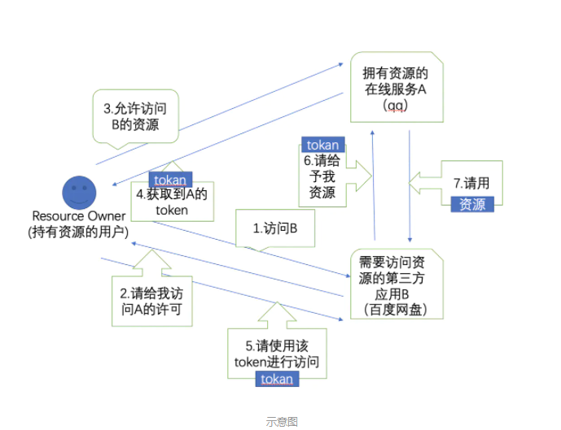

[Toc]

----

### OAuth2.0(授权码模式)

 OAuth是一个关于授权（authorization）的开放网络标准，在全世界得到广泛应用，目前的版本是2.0版 。

 授权码模式（authorization code）是功能最完整、流程最严密的授权模式。它的特点就是通过客户端的后台服务器，与"服务提供商"的认证服务器进行互动。

> [原图地址](https://www.jianshu.com/p/8ae299e1ac7c)

1. 登陆QQ登陆，使用QQ账号登陆百度网盘。
2. 百度网盘去请求QQ的认证服务器，请求成功后，百度QQ的认证服务器会会返回一个重定向的地址，类似这种并附上一个授权码Code http://www.qq.com/authorize?callback=www.douban.com/callback 。
3. 浏览器重定向到对应的地址（使用QQ登陆百度网盘页面）后，QQ根据返回的Code会向百度网盘的认证服务器再去请求对应的token。
4. 请求成功后，百度网盘的认证服务器会返回一个 access_token 和一个  refresh_token 。
5. QQ携带着access_token去访问百度网盘的资源服务器 。
6. 百度网盘认证服务器验证token是否有效。
7. token正常可用，百度网盘资源服务器返回对应的资源。

**需要注意的问题**

1. refresh_token  是用户获取access_token 的，由于access_token 的有效期是比较短的，所以当access_token 过期时，就需要使用refresh_token  去重新获取新的access_token ，通常来说refresh_token  的使用时间一般很长 一天甚至更长时间。
2. 3之前的步骤是发生浏览器的。4之后的步骤是发生在请求资源的服务器和被请求资源的服务器之间，由于不经过浏览器比较安全的，不需要担心refresh_token  被泄露的问题。
3. OAuth 主要 **开放授权** 、授权。

>参考文章
>
><http://www.ruanyifeng.com/blog/2014/05/oauth_2_0.html>
>
><https://www.cnblogs.com/flashsun/p/7424071.html#!comments>

### OpenId

 OpenID是一个以用户为中心的数字身份识别框架，是一个以URL为身份标识的分散式身份验证解决方案，它具有开放、分散、自由等特性。

对于上图显示的先用账号和面登陆QQ然后，当我们在使用QQ登陆百度网盘时，如果QQ认为你现在登陆的账号是合法的也就是说你的账号对于QQ来说是安全可靠的，那么接下来的请求中，QQ会在请求时告诉百度网盘的服务器这个登录的用户在我这里是安全的，也就是身份认证成功，然后百度网盘才能允许你接下来的行为。

> 参考文章
>
> <https://blog.csdn.net/cnwuyuqun/article/details/5685518?utm_medium=distribute.pc_relevant.none-task-blog-2%7Edefault%7EBlogCommendFromMachineLearnPai2%7Edefault-1.control&dist_request_id=1619760551068_59287&depth_1-utm_source=distribute.pc_relevant.none-task-blog-2%7Edefault%7EBlogCommendFromMachineLearnPai2%7Edefault-1.control>

### Jwt(Json Web Token)

> Json web token (JWT), 是为了在网络应用环境间传递声明而执行的一种基于JSON的开放标准（[(RFC 7519](https://link.jianshu.com?t=https://tools.ietf.org/html/rfc7519)).该token被设计为紧凑且安全的，特别适用于分布式站点的单点登录（SSO）场景。JWT的声明一般被用来在身份提供者和服务提供者间传递被认证的用户身份信息，以便于从资源服务器获取资源，也可以增加一些额外的其它业务逻辑所必须的声明信息，该token也可直接被用于认证，也可被加密。

Jwt 由三部分组成

header  用来申明token类型和token加密的算法，通常直接使用 HMAC SHA256 

payload 有效载荷，里面存放了一些标准信息或者，自定义信息。

自定义信息：

**iss**: jwt签发者

 **sub**: jwt所面向的用户

 **aud**: 接收jwt的一方

 **exp**: jwt的过期时间，这个过期时间必须要大于签发时间

 **nbf**: 定义在什么时间之前，该jwt都是不可用的.

 **iat**: jwt的签发时间

 **jti**: jwt的唯一身份标识，主要用来作为一次性token,从而回避重放攻击。