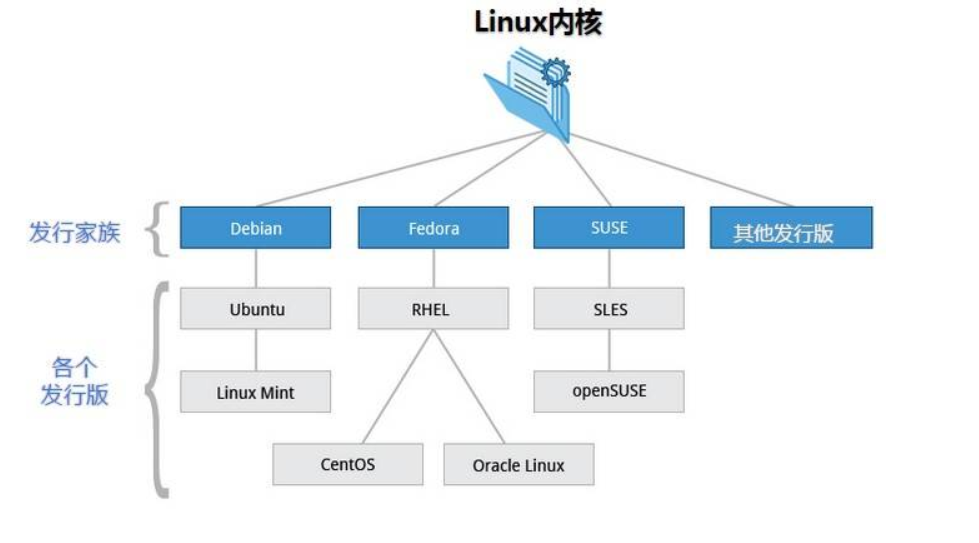

[Toc]

---

### 简介
>Linux 内核最初只是由芬兰人林纳斯·托瓦兹（Linus Torvalds）在赫尔辛基大学上学时出于个人爱好而编写的。Linux 是一套免费使用和自由传播的类 Unix 操作系统，是一个基于 POSIX 和 UNIX 的多用户、多任务、支持多线程和多 CPU 的操作系统。Linux 能运行主要的 UNIX 工具软件、应用程序和网络协议。它支持 32 位和 64 位硬件。Linux 继承了 Unix 以网络为核心的设计思想，是一个性能稳定的多用户网络操作系统。

### 发行版
>Linux 的发行版说简单点就是将 Linux 内核与应用软件做一个打包


#### 发行版本
>目前市面上较知名的发行版有：Ubuntu、RedHat、CentOS、Debian、Fedora、SuSE、OpenSUSE、Arch Linux、SolusOS 等


### 特点
#### 重要思想
1. 一切皆文件。 详细来讲就是系统中的所有都归结为一个文件，包括命令、硬件和软件设备、操作系统、进程等等对于操作系统内核而言，都被视为拥有各自特性或类型的文件。
2. 命令行模式下，输入命令后没有回复就是最好的回复，如果命令正确，则Linux不会返回任何信息，如果命令有问题，则会抛出异常。
#### 完全免费
   Linux是一款免费的操作系统，用户可以通过网络或其他途径免费获得，并可以任意修改其源代码。这是其他的操作系统所做不到的。正是由于这一点，来自全世界的无数程序员参与了Linux的修改、编写工作，程序员可以根据自己的兴趣和灵感对其进行改变，这让Linux吸收了无数程序员的精华，不断壮大。
#### 多用户、多任务
   Linux支持多用户，各个用户对于自己的文件设备有自己特殊的权利，保证了各用户之间互不影响。多任务则是现代电脑最主要的一个特点，Linux可以使多个程序同时并独立地运行。
#### 良好的界面
   Linux同时具有字符界面和图形界面。在字符界面用户可以通过键盘输入相应的指令来进行操作。它同时也提供了类似Windows图形界面的X-Window系统，用户可以使用鼠标对其进行操作。在X-Window环境中就和在Windows中相似，可以说是一个Linux版的Windows。

### Linux VS Windows

| 比较     | Windows                                                      | Linux                                                        |
| -------- | ------------------------------------------------------------ | ------------------------------------------------------------ |
| 界面     | 界面统一，外壳程序固定所有 Windows 程序菜单几乎一致，快捷键也几乎相同 | 图形界面风格依发布版不同而不同，可能互不兼容。GNU/Linux 的终端机是从 UNIX 传承下来，基本命令和操作方法也几乎一致。 |
| 驱动程序 | 驱动程序丰富，版本更新频繁。默认安装程序里面一般包含有该版本发布时流行的硬件驱动程序，之后所出的新硬件驱动依赖于硬件厂商提供。对于一些老硬件，如果没有了原配的驱动有时很难支持。另外，有时硬件厂商未提供所需版本的 Windows 下的驱动，也会比较头痛。 | 由志愿者开发，由 Linux 核心开发小组发布，很多硬件厂商基于版权考虑并未提供驱动程序，尽管多数无需手动安装，但是涉及安装则相对复杂，使得新用户面对驱动程序问题（是否存在和安装方法）会一筹莫展。但是在开源开发模式下，许多老硬件尽管在Windows下很难支持的也容易找到驱动。HP、Intel、AMD 等硬件厂商逐步不同程度支持开源驱动，问题正在得到缓解。 |
| 使用     | 使用比较简单，容易入门。图形化界面对没有计算机背景知识的用户使用十分有利。 | 图形界面使用简单，容易入门。文字界面，需要学习才能掌握。     |
| 学习     | 系统构造复杂、变化频繁，且知识、技能淘汰快，深入学习困难。   | 系统构造简单、稳定，且知识、技能传承性好，深入学习相对容易。 |
| 软件     | 每一种特定功能可能都需要商业软件的支持，需要购买相应的授权。 | 大部分软件都可以自由获取，同样功能的软件选择较少。           |
### Linux系统启动过程
#### 内核的引导
当计算机打开电源后，首先是BIOS开机自检，按照BIOS中设置的启动设备（通常是硬盘）来启动。操作系统接管硬件以后，首先读入 /boot 目录下的内核文件。


#### 运行init
init 进程是系统所有进程的起点，你可以把它比拟成系统所有进程的老祖宗，没有这个进程，系统中任何进程都不会启动。init 程序首先是需要读取配置文件 /etc/inittab。

**许多程序需要开机启动。它们在Windows叫做"服务"（service），在Linux就叫做"守护进程"（daemon）。**

#### 系统初始化
在init的配置文件中有这么一行： si::sysinit:/etc/rc.d/rc.sysinit　它调用执行了/etc/rc.d/rc.sysinit，而rc.sysinit是一个bash shell的脚本，它主要是完成一些系统初始化的工作，rc.sysinit是每一个运行级别都要首先运行的重要脚本。它主要完成的工作有：激活交换分区，检查磁盘，加载硬件模块以及其它一些需要优先执行任务。


#### 建立终端
init接下来会打开6个终端，以便用户登录系统。在inittab中的以下6行就是定义了6个终端：
```
1:2345:respawn:/sbin/mingetty tty1
2:2345:respawn:/sbin/mingetty tty2
3:2345:respawn:/sbin/mingetty tty3
4:2345:respawn:/sbin/mingetty tty4
5:2345:respawn:/sbin/mingetty tty5
6:2345:respawn:/sbin/mingetty tty6
```
#### 用户登录系统

一般来说，用户的登录方式有三种：
（1）命令行登录
（2）ssh登录
（3）图形界面登录


### Linux目录结构

目录详解:
/bin  是Binary的缩写，存放经常使用的命令

/boot 存放Liunx时使用的一些核心文件，包括一些链接文件以及镜像文件

/dev 是Device（设备）的缩写，存放的是Linux的外部设备，在Linux中访问设备的方式和访问文件的方式是相同的

/etc 是 Etcetera(等等) 的缩写，用来存放所有系统关系所需要的配置文件和子目录

/home 用户的主目录，每个用户都有一个自己的目录，一般该目录名是以用户的账号命名的，如上图中的 alice、bob 和 eve

/lib 是 Library(库) 的缩写这个目录里存放着系统最基本的动态连接共享库，其作用类似于 Windows 里的 DLL 文件。几乎所有的应用程序都需要用到这些共享库

/lost+found 这个目录一般情况下是空的，当系统非法关机后，这里就存放了一些文件

/media linux 系统会自动识别一些设备，例如U盘、光驱等等，当识别后，Linux 会把识别的设备挂载到这个目录下。

/mnt：系统提供该目录是为了让用户临时挂载别的文件系统的，我们可以将光驱挂载在 mnt/ 上，然后进入该目录就可以查看光驱里的内容了。

/opt：opt 是 optional(可选) 的缩写，这是给主机额外安装软件所摆放的目录。比如你安装一个ORACLE数据库则就可以放到这个目录下。默认是空的。

/proc：proc 是 Processes(进程) 的缩写，/proc 是一种伪文件系统（也即虚拟文件系统），存储的是当前内核运行状态的一系列特殊文件，这个目录是一个虚拟的目录，它是系统内存的映射，我们可以通过直接访问这个目录来获取系统信息。这个目录的内容不在硬盘上而是在内存里，我们也可以直接修改里面的某些文件，比如可以通过下面的命令来屏蔽主机的ping命令，使别人无法ping你的机器：
``` shell
echo 1 > /proc/sys/net/ipv4/icmp_echo_ignore_all
```
/root：该目录为系统管理员，也称作超级权限者的用户主目录。

/sbin：s 就是 Super User 的意思，是 Superuser Binaries (超级用户的二进制文件) 的缩写，这里存放的是系统管理员使用的系统管理程序。

/srv： 该目录存放一些服务启动之后需要提取的数据。

/sys：这是 Linux2.6 内核的一个很大的变化。该目录下安装了 2.6 内核中新出现的一个文件系统 sysfs 。sysfs 文件系统集成了下面3种文件系统的信息：针对进程信息的 proc 文件系统、针对设备的 devfs 文件系统以及针对伪终端的 devpts 文件系统。该文件系统是内核设备树的一个直观反映。当一个内核对象被创建的时候，对应的文件和目录也在内核对象子系统中被创建。

/tmp：tmp 是 temporary(临时) 的缩写这个目录是用来存放一些临时文件的。

/usr： usr 是 unix shared resources(共享资源) 的缩写，这是一个非常重要的目录，用户的很多应用程序和文件都放在这个目录下，类似于 windows 下的 program files 目录。

/usr/bin：系统用户使用的应用程序。

/usr/sbin：超级用户使用的比较高级的管理程序和系统守护程序。

/usr/src：内核源代码默认的放置目录。

/var：var 是 variable(变量) 的缩写，这个目录中存放着在不断扩充着的东西，我们习惯将那些经常被修改的目录放在这个目录下。包括各种日志文件。

/run：是一个临时文件系统，存储系统启动以来的信息。当系统重启时，这个目录下的文件应该被删掉或清除。如果你的系统上有 /var/run 目录，应该让它指向 run。


**在 Linux 系统中，有几个目录是比较重要的，平时需要注意不要误删除或者随意更改内部文件。
/etc： 这个是系统中的配置文件，如果你更改了该目录下的某个文件可能会导致系统不能启动。
/bin, /sbin, /usr/bin, /usr/sbin: 这是系统预设的执行文件的放置目录，比如 ls 就是在 /bin/ls 目录下的。值得提出的是，/bin, /usr/bin 是给系统用户使用的指令（除root外的通用户），而/sbin, /usr/sbin 则是给 root 使用的指令。
/var： 这是一个非常重要的目录，系统上跑了很多程序，那么每个程序都会有相应的日志产生，而这些日志就被记录到这个目录下，具体在 /var/log 目录下，另外 mail 的预设放置也是在这里。**
**Linux 的目录结构是树状结构，最顶级的目录是根目录 /**
### 文件属性
>Linux 系统是一种典型的多用户系统，不同的用户处于不同的地位，拥有不同的权限。为了保护系统的安全性，Linux 系统对不同的用户访问同一文件（包括目录文件）的权限做了不同的规定。
>

图示中，文件的第一列表示的就是文件的属性。


Linux 中第一个字符代表的是文件的类型，
``` sehll
d    # 表示的是目录
-    #  表示的是文件
l    # 表示的是链接文件  
b    #表示为装置文件里面的可供储存的接口设备(可随机存取装置)
c   # 表示为装置文件里面的串行端口设备，例如键盘、鼠标(一次性读取装置)。
```
接下来3个字符为一组，且均为 rwx 的三个参数的组合。其中， r 代表可读(read)、 w 代表可写(write)、 x 代表可执行(execute)。 要注意的是，这三个权限的位置不会改变，如果没有权限，就会出现减号 - 而已。
**属主：文件的所有者，就是对该文件具有所有权的用户**
**属组：和文件所有者同组的用户**
**对于 root 用户来说，一般情况下，文件的权限对其不起作用。**
### Linux命令
#### 关机/重启命令
关机指令为：shutdown ，你可以man shutdown 来看一下帮助文档。
正确的关机流程为：sync > shutdown > reboot > halt
**不管是重启系统还是关闭系统，首先要运行 sync 命令，把内存中的数据写到磁盘中。**
``` shell
shutdown –h 10 # 这个命令告诉大家，计算机将在10分钟后关机
shutdown –h now # 立马关机
shutdown –h 20:25 # 系统会在今天20:25关机
shutdown –h +10 # 十分钟后关机
shutdown –r now # 系统立马重启
shutdown –r +10 # 系统十分钟后重启
reboot # 就是重启，等同于 shutdown –r now
halt # 关闭系统，等同于shutdown –h now 和 poweroff
```
#### 处理目录的常用命令

ls（英文全拼：list files）: 列出目录及文件名

cd（英文全拼：change directory）：切换目录

pwd（英文全拼：print work directory）：显示目前的目录

mkdir（英文全拼：make directory）：创建一个新的目录

rmdir（英文全拼：remove directory）：删除一个空的目录

cp（英文全拼：copy file）: 复制文件或目录

rm（英文全拼：remove）: 移除文件或目录  eg:rm -rf [filename]递归删除文件夹下的所有的文件，并删除文件夹

mv（英文全拼：move file）: 移动文件与目录，或修改文件与目录的名称

pwd Print Working Directory 的缩写，也就是显示目前所在目录的命令

touch 创建文件，也可以是一个带文件的路径

#### 查看文件内容命令

cat  由第一行开始显示文件内容

tac  从最后一行开始显示，可以看出 tac 是 cat 的倒着写！

nl   显示的时候，顺道输出行号！

more 一页一页的显示文件内容

less 与 more 类似，但是比 more 更好的是，他可以往前翻页！

head 只看头几行

tail 只看尾巴几行